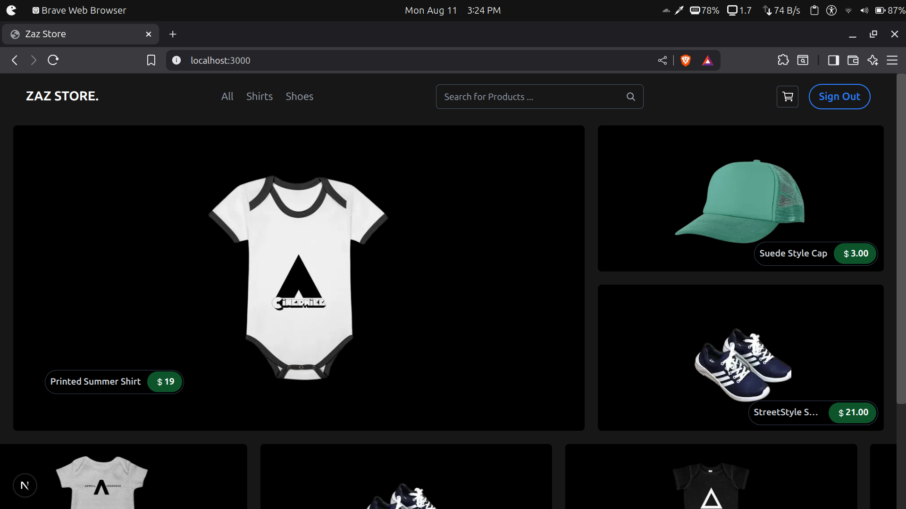
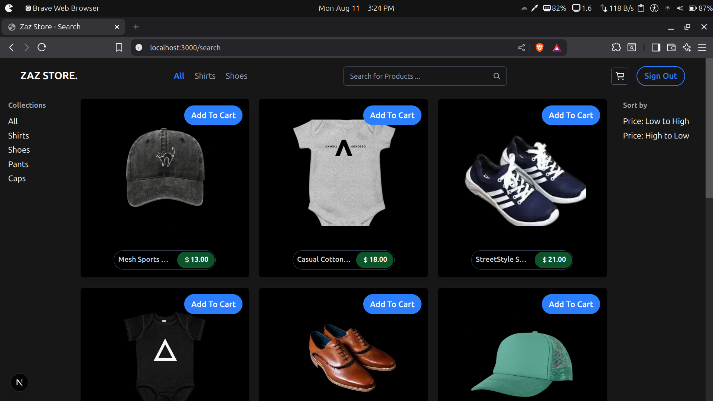
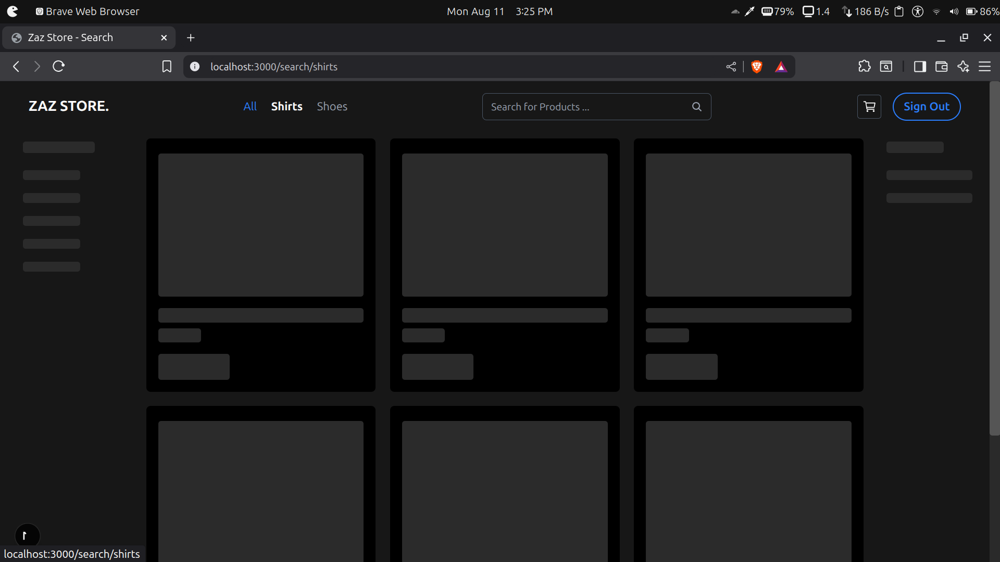
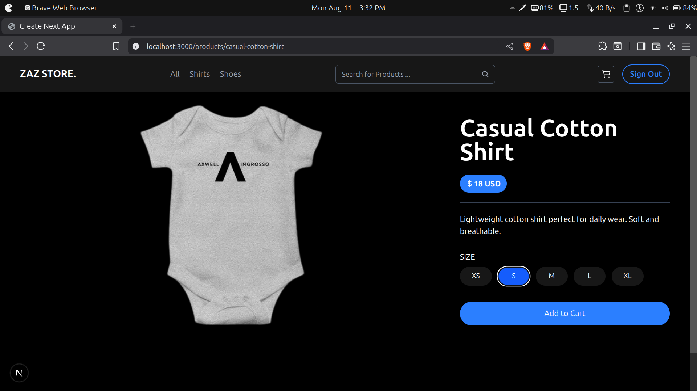
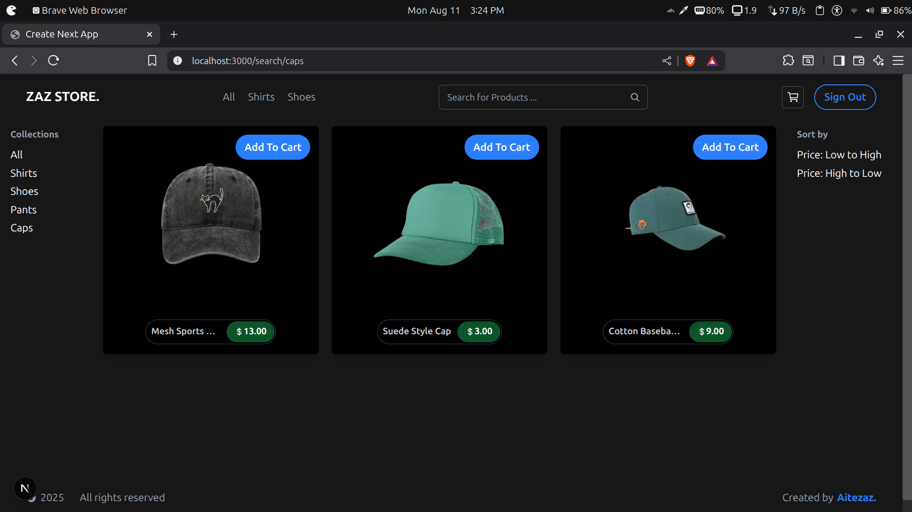
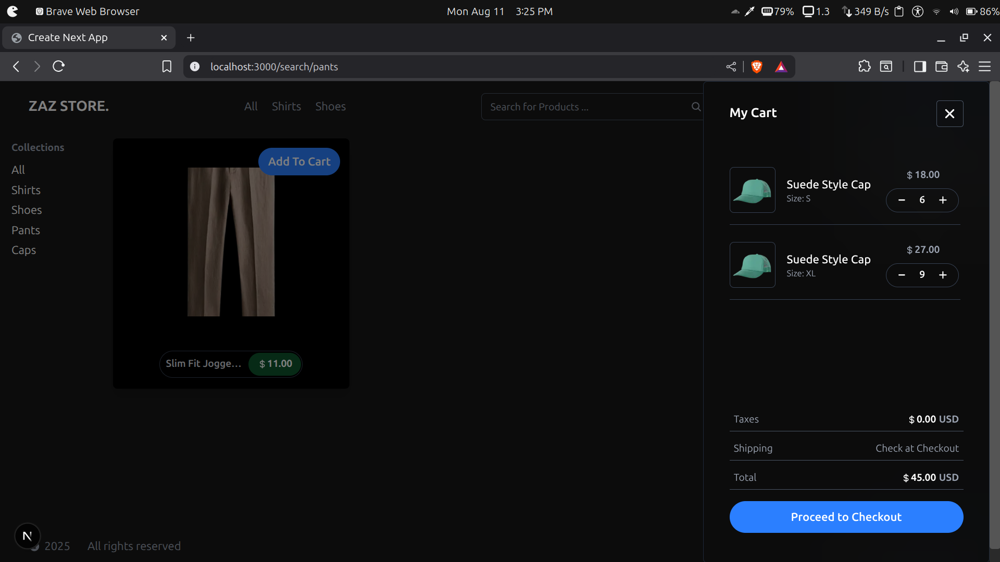

# Next.js Ecommerce Web App

This is a **full-stack e-commerce application** built using the **MERN stack** (MongoDB, Express.js, React, Node.js) with **Next.js** for the frontend. The backend APIs are powered by Next.js API routes, and MongoDB is used for data storage. It integrates **Redux Toolkit** for global state management, **Stripe** for payment processing, and **Zod** for input validation.

## Features

* **User Authentication**
* **Product Search & Filtering**
* **Sorting Options**
* **Shopping Cart**
* **Responsive UI**
* **Stripe Checkout**
* **Protected Routes / components**

## Getting Started

You can clone this repository and run the application locally:

```bash
git clone https://github.com/vilezaz/Next.js-Ecommerce.git

cd Next.js-Ecommerce
npm install
npm run dev
```


## Screenshots

Below are some preview images of the application (stored in the `public/` folder):

### Home Page

### All Products Page

### Loading Skeltons For Pages

### Product Details

### Category Page

### Cart View


---
